# Отчет по практической работе №1: Конечные автоматы

- **Дисциплина:** Теория автоматов, языков и вычислений
- **Тема:** Реализация и исследование детерминированных и недетерминированных конечных автоматов
- **Вариант:** № 13
- **Выполнил:** Козелков Д. И. КИ24-16/1б
- **Проверил:** Кузнецов А. С.

---

**Цель:** изучение принципов функционирования, проектирование в среде JFLAP и программная реализация детерминированных (ДКА) и недетерминированных (НКА) конечных автоматов с использованием табличного представления.

**Постановка задачи (Вариант 1):**

1. **Часть А (ДКА):** Построить ДКА, допускающий в алфавите {a, b} цепочки
   w1abw2, где w1,w2 принадлежат {a,b}\*
2. **Часть Б (НКА):** Построить НКА, допускающий язык из цепочек из 0 и 1, в которых нет
   подцепочки 101.

---

## Разработка детерминированного конечного автомата (ДКА)

### Формальное описание автомата

ДКА задается кортежем $M_{DFA} = (Q, \Sigma, \delta, q_0, F)$:

- Множество состояний: $Q = \{q_0, q_1, q_2\}$
- Входной алфавит: $\Sigma = \{a, b\}$
- Начальное состояние: $q_0$
- Множество допускающих состояний: $F = \{q_2\}$

### Таблица переходов функции $\delta(q, \sigma)$

| Состояние | Символ $a$ | Символ $b$ | Пояснение   |
| :-------: | :--------: | :--------: | :---------- |
| $\to q_0$ |   $q_1$    |   $q_0$    | Начальное   |
|   $q_1$   |   $q_1$    |   $q_2$    |             |
|  $*q_2$   |   $q_2$    |   $q_2$    | Допускающее |

### Граф переходов ДКА

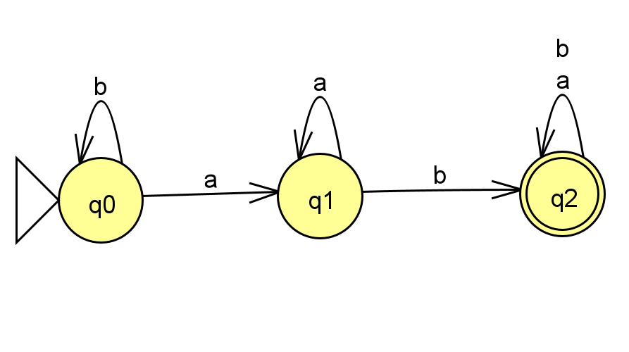

### Трассировка и результаты тестирования

**Результаты множественного тестирования (JFLAP Multiple Run):**
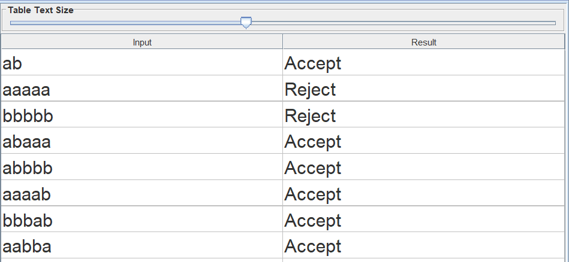

**Пошаговое выполнение процесса распознавания цепочек:**

- Распознавание допустимой цепочки `aaaba` (`Accept`):
  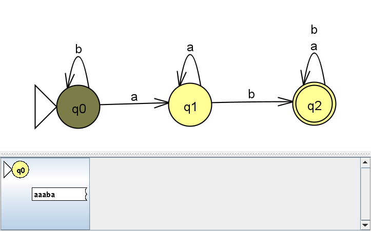
  
  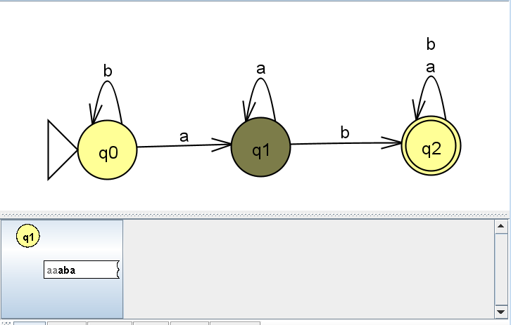
  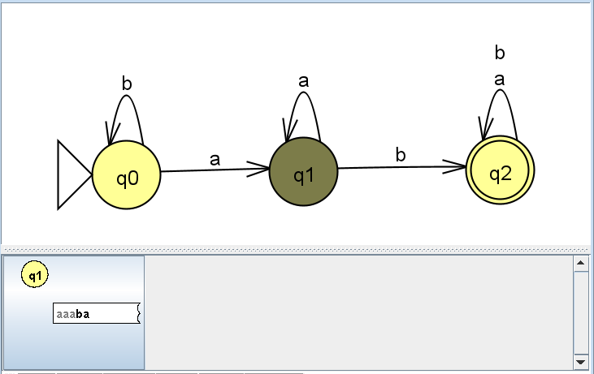
  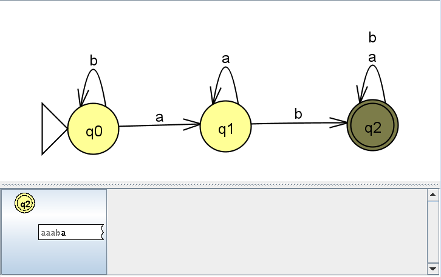
  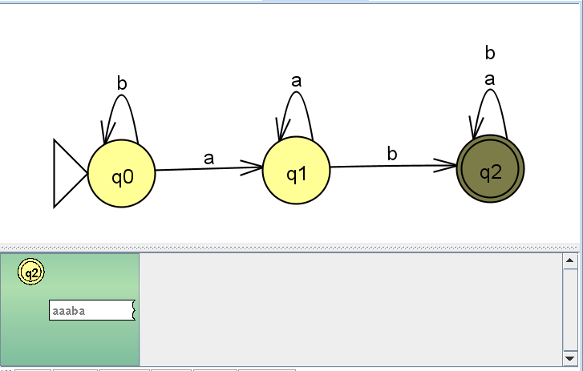

- Распознавание недопустимой цепочки `bbb` (`Reject`):\
  
  
  
  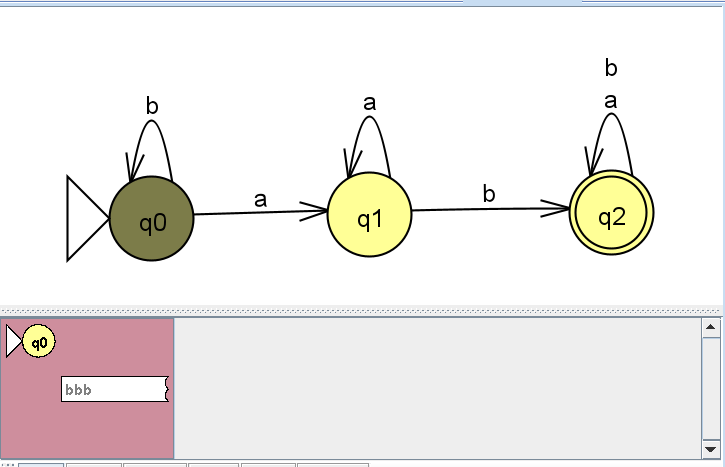

---

## Разработка недетерминированного конечного автомата (НКА)

### Формальное описание автомата

НКА задается кортежем $M_{NFA} = (Q, \Sigma, \delta, q_0, F)$:

- Множество состояний: $Q = \{q_0, q_1, q_2, q_3\}$
- Входной алфавит: $\Sigma = \{0, 1\}$
- Начальное состояние: $q_0$
- Множество допускающих состояний: $F = \{q_0, q_1, q_2\}$

Логика автомата основана на том, что автомат угадывает, где могла бы начаться запрещённая подстрока 101, и одновременно проверяет все гипотезы. Если хоть одна «ветка» дойдёт до ловушки Q3 и при этом ни одна ветка не осталась в допускающем состоянии — строка отвергается.

### Таблица переходов функции $\delta(q, \sigma)$

| Состояние |   Символ $0$   | Символ $1$ |
| :-------: | :------------: | :--------: |
| $\to q_0$ | $\{q_0, q_2\}$ | $\{q_1\}$  |
|   $q_1$   |   $\{q_2\}$    | $\{q_1\}$  |
|   $q_2$   |   $\{q_0\}$    | $\{q_3\}$  |
|   $q_3$   |   $\{q_3\}$    | $\{q_3\}$  |

### Граф переходов НКА

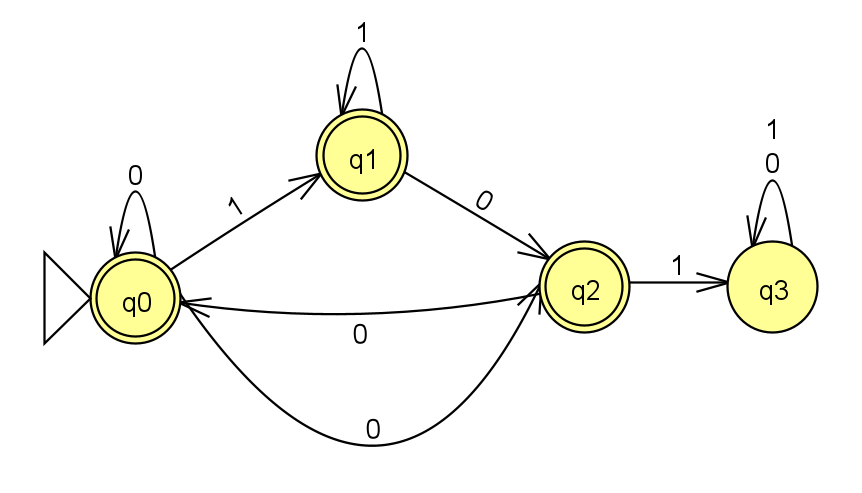

### Трассировка и результаты тестирования

**Результаты множественного тестирования (JFLAP Multiple Run):**
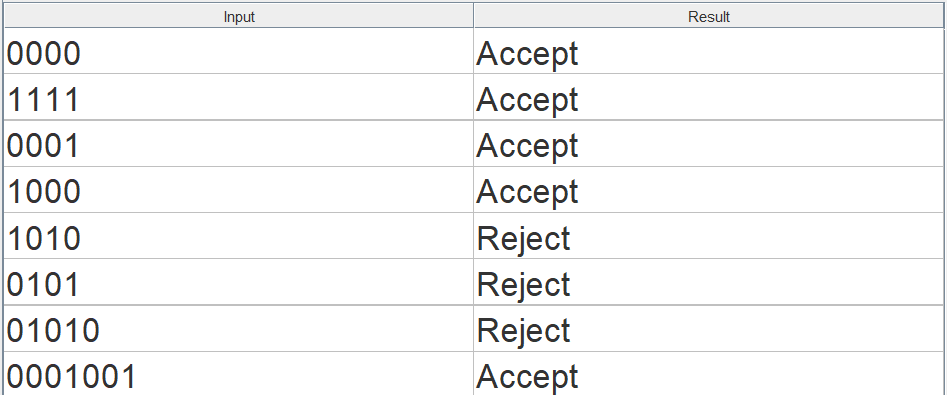

**Пошаговое выполнение процесса распознавания цепочек:**

- Распознавание допустимой цепочки `0001` (`Accept`):
  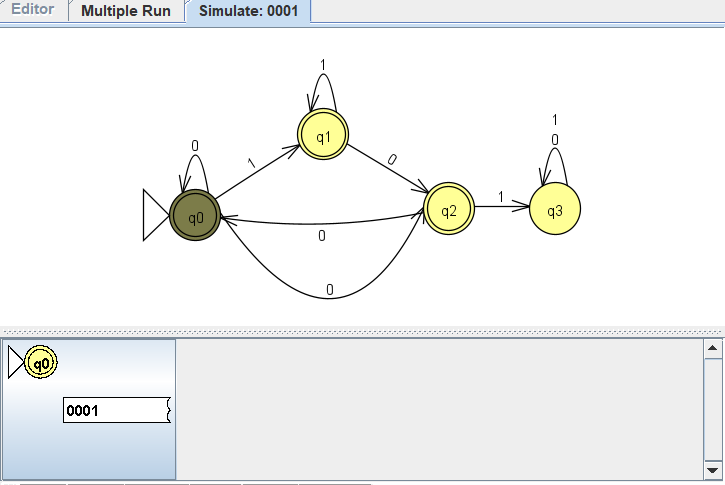
  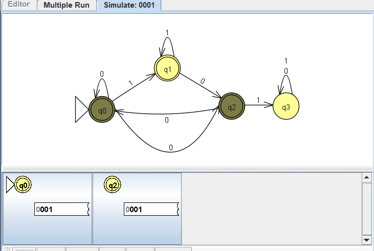
  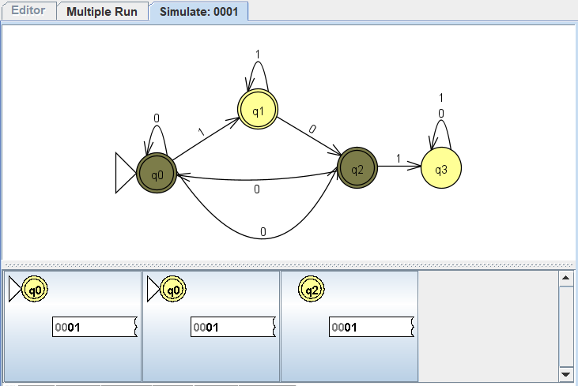
  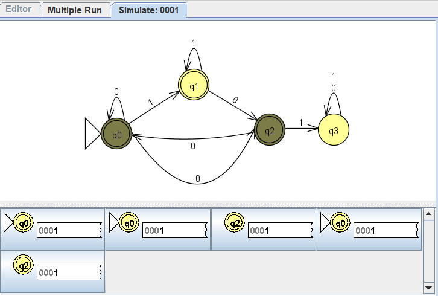
  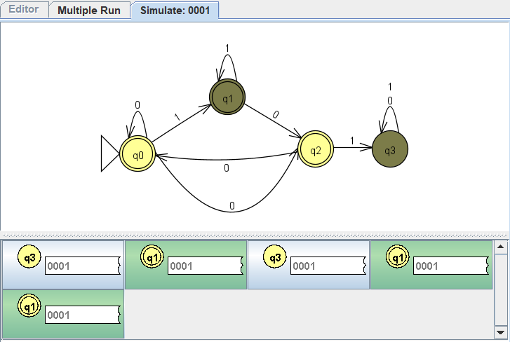
  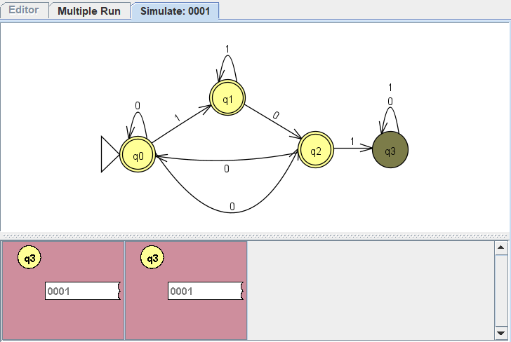

- Распознавание недопустимой цепочки `0101` (`Reject`):
  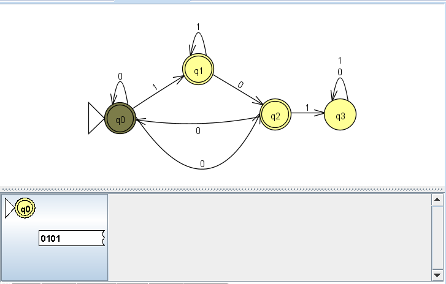
  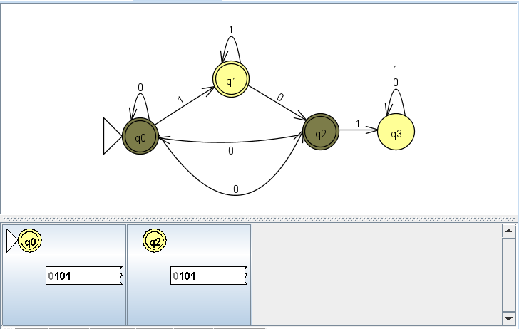
  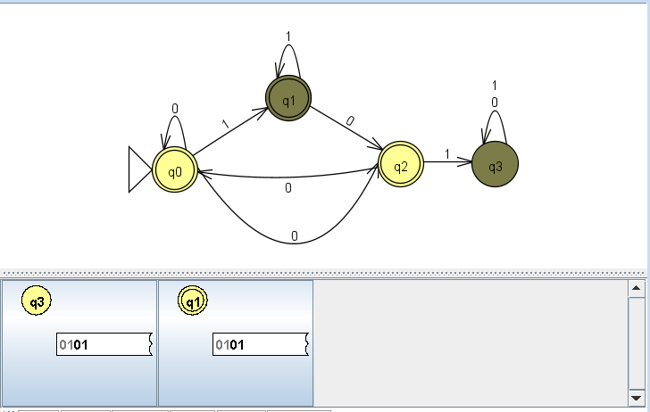
  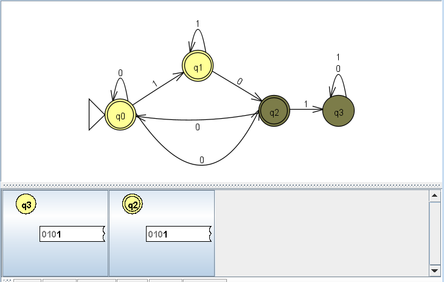
  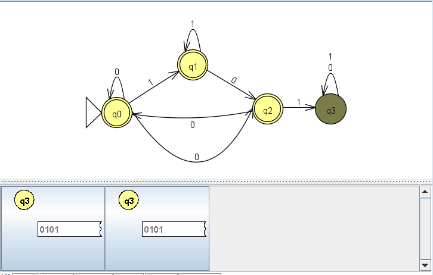
  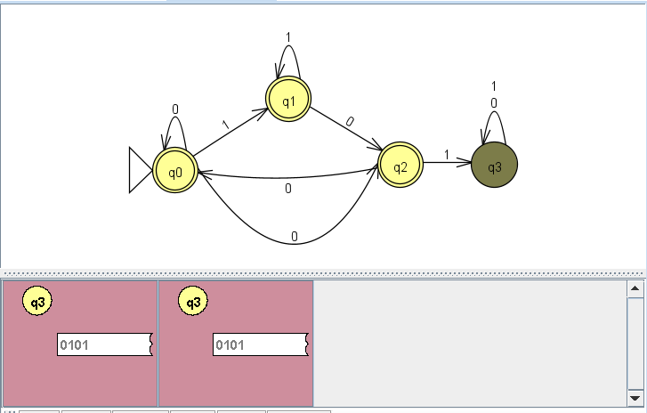

---

## Выводы

В ходе работы были построены и проанализированы детерминированный и недетерминированный конечные автоматы в программе JFLAP, а также выполнена их программная реализация на языке Python с применением табличной модели переходов. Результаты пошагового выполнения и пакетного тестирования подтвердили идентичность работы программной модели и среды JFLAP.
